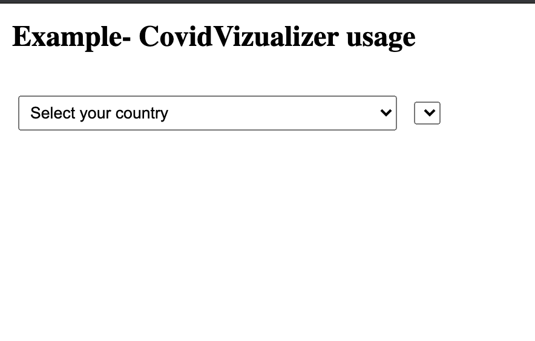
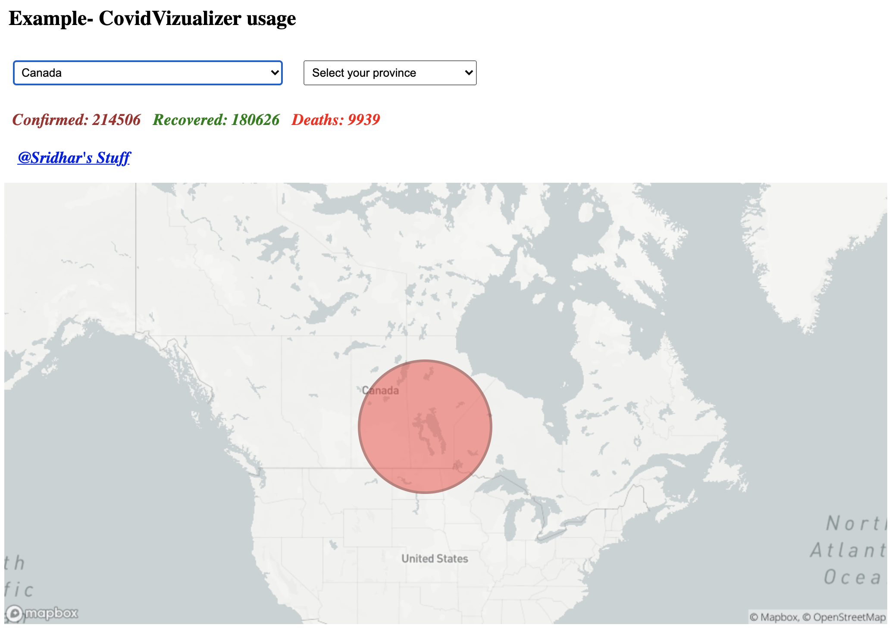

<p align="center">
  
</p>
</br>
<h2>CovidVizualizer :</h2>
<b>A NPM package that plots and displays the Covid information.</b>

TABLE OF CONTENTS

 <pre> INTRODUCTION </pre>
<pre> USAGE </pre>
<pre> SPECIFICATIONS </pre>
<pre> SOFTWARES REQUIRED </pre>
<pre> SOURCE CODE </pre>
<pre> INSTALLATION NOTES </pre>
<pre> ABOUT THE APPLICATION </pre>

INTRODUCTION
A NPM that plots and displays the Covid-19 information in the Browser. This package also returns the information that is being used for the rendering purposes.
<br><br>
<b>Check out this video to see the demo.</b>

[](https://www.youtube.com/watch?v=t9d-gSbb9cw&ab_channel=HighbrowFrolics)

<pre><i>If the above video doesn't seem to work, you can find the same clip of Demo at (~/readme_figs/DemoVideos/CovidExtensionDemo.mp4) location.</i></pre>

USAGE

<pre>Use the following snippet in the UI HTML file where you wish the map to be rendered.</pre>
<ul>
<li>The following component/HTML tags are required with the exact same IDs for the package to function as desired.
<pre>
```html
<div id='covidVizualizerDiv' style="width: 1024px; height: 512px;">
<select id='countriesList'></select>
<select id='provincesList'></select>
<h3 id='covidInfo'></h3>
<div id='covidMapArea'></div>
</div>
```
</pre>
</li>
</ul>
<pre>The following methods can be used to obtain the respective outcome.</pre>
<ul>
<li>getCountriesInfo -> to get the list of countries' names and codes for which the COVID-19 information is available.
<pre>
covidvizualizer.getCountriesInfo({ showLogs: true })
</pre>
</li>
<li>getCovidInfo -> to get the COVID-19 information for the selected country. 
<pre>
covidvizualizer.getCovidInfo({ selectedCountry: 'canada', showLogs: true })
</pre>
</li>
<li>renderCovidMap -> to plot and render the COVID-19 information for the selected country on the Map.
<pre>
covidvizualizer.renderCovidMap({
    zoomType: 'country',
    showLogs: true,
    theme: 'dark',
    covidDisplayInfo: {},
});
</pre> 
</li>
</ul>

<pre>The structure of 'covidDisplayInfo' being returned by the 'getCovidInfo' method is as follows:</pre>
<ul>
<li>
<pre>
covidDisplayInfo = {
        countryInfo: {
            countryName: 'Countryname',
            covidStatusInfo: {
                confirmed: 0,
                recovered: 0,
                deaths: 0
            },
            latitude: 0.0,
            longitude: 0.0
        },
        provinceInfo: [
            {
                provinceName: 'Provincename',
                covidStatusInfo: {
                    confirmed: 0,
                    recovered: 0,
                    deaths: 0
                  },
                  latitude: 0.0,
                  longitude: 0.0
            }
        ]
    }
</pre>
</li>
</ul>

<pre>The following zoom Types are available for the Map. Pass the option 'zoomType' with one of the following two options:</pre>
<ul>
<li>'country' -> to set the zoom for displaying Covid-19 information onto Country-level layout of the Map. </li>
<li>'province' -> to set the zoom for displaying Covid-19 information onto Province-level layout of the Map. </li>
</ul>

<pre>The following themes are available for the Map. Pass the option 'theme' with one of the following two options:</pre>
<ul>
<li>'dark' -> to get the Dark layout of the Map. </li>
<li>'light' -> to get the Light/Bright layout of the Map. </li>
</ul>

<pre>The following Log options are available for displaying the logs on the browser console. Pass the option 'showLogs' with one of the following two options:</pre>
<ul>
<li>true -> to show the logs on the browser console. </li>
<li>false -> to not show the logs on the browser console. </li>
<li><b> Irrespective of the options chosen for 'showLogs', Error messages would still be displayed in the console. </b></li>
</ul>

SPECIFICATIONS

 <pre>A NPM package which returns the COVID-19 information along with Countries List and Provinces List. It also accepts the Country and Province (if available), then creates the Map to be displayed with COVID-19 information in the region.</pre>
<ul>
<li> Display a dropdown "Choose your Country:" in the Top to allow user to select a Country.</li>
<li> Display a dropdown "Choose your Province:" in the Top to allow user to select a Province if the provinces list is returned by the API.</li>
<li> Update the zoom level on the Map based on the type of selection made i.e. Country to be zoomed less and Province to be zoomed closer.</li>
<li> Refresh the Map upon detection of change in the options chosen from each dropdown and Re-render the information.</li>
</ul>
<pre>Refer to the following Example files Included in the Respository:</pre>
<ul>
<li> <a href='./exampleUsage'>Usage Example</a> </li>
</ul>

SOFTWARES REQUIRED
The software that are needed for the application to be edited or executed

<ul>
<li> OPERATING SYSTEM UTILIZED: MAC OS- Catalina </li>
<li> ‘technology’ --> javascript</li>
<li> ‘map’ --> mapbox</li>
<li> ‘API resource’ --> <a href="https://documenter.getpostman.com/view/10808728/SzS8rjbc#9739c95f-ef1d-489b-97a9-0a6dfe2f74d8">COVID API used</a></li>
</ul>

SOURCE CODE\
 The Source code for the application is in the 'CovidVizualizer' folder

<ul>
<li> 'exampleUsage' --> Has all the files which can be refered for understanding the Usage of this NPM package.</li>
<li> 'covidVizualizer.js' --> Entry point. Has the important methods which detect the presence of the required Divs in the UI.</li>
<li> 'fetchData' --> Has the code snippets for fetching the information from the API.</li>
<li> 'MapCreator' --> Has the code snippets for plotting and rendering the map with the COVID-19 information onto the UI.</li>
</ul>

INSTALLATION NOTES\
 Use the following command to install the CovidVizualizer NPM package in your project.

<ol type="A">
<li> Global installation
<pre>
npm install --global covidvizualizer
[or]
npm i -g covidvizualizer
</pre> 
</li>
<li> Dev dependency installation
<pre>
npm install --save-dev covidvizualizer
[or]
npm i --save-dev covidvizualizer
</pre> 
 </li>
</ol>

ABOUT THE APPLICATION\
 This application loads the list of Country names and Province names[if available] and render the COVID-19 information in the UI upon the completion of the steps specified in the ‘INSTALLATION NOTES’ section.

The application loads the dropdown for CountriesList with the "Choose your Country" dropdown text selected by default. Figure 1 shows the screen when the package is loaded.



    Figure 1: Start-up Screen


    Figure 2: UI when the country is selected - 'dark' theme.


    Figure 3: UI after a province is selected - 'dark' theme.



    Figure 4: Display of the Map with 'light' theme.


    Figure 4: Display of the Logs in the browser console when 'showLogs' is set to true.
